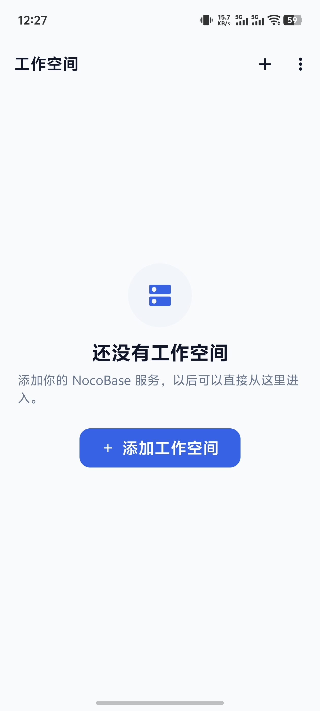
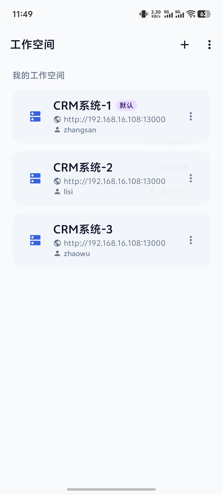
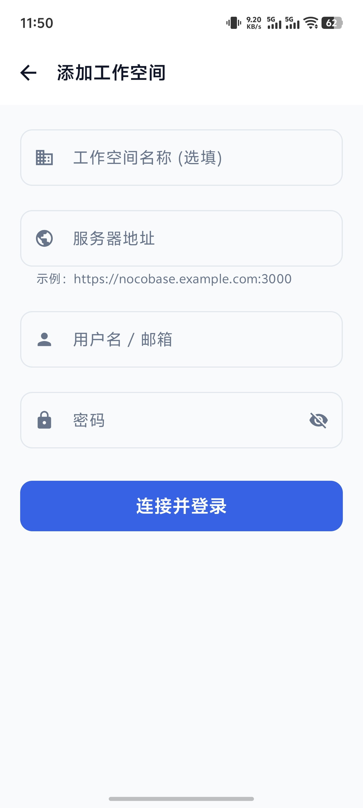
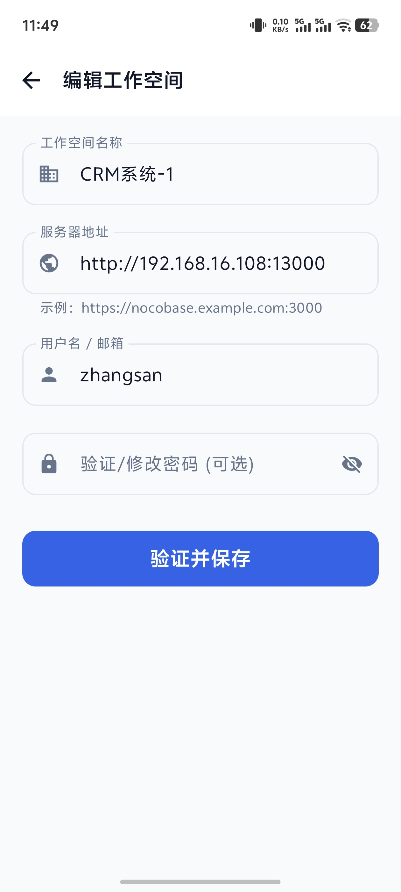
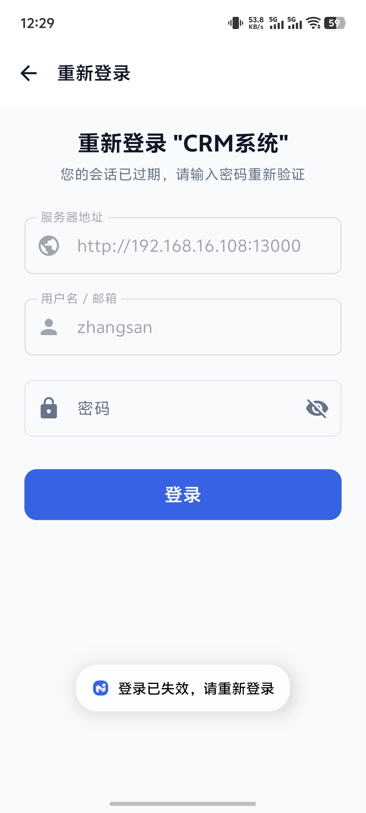
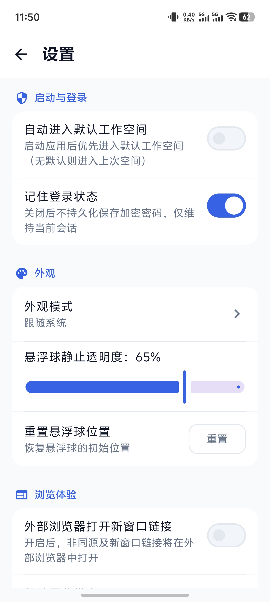
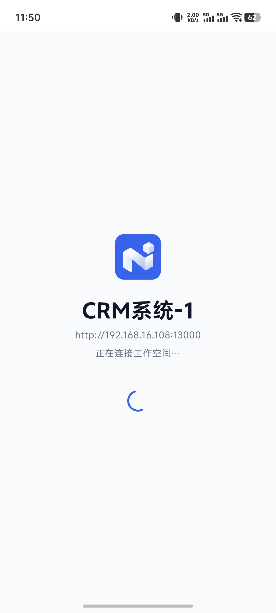
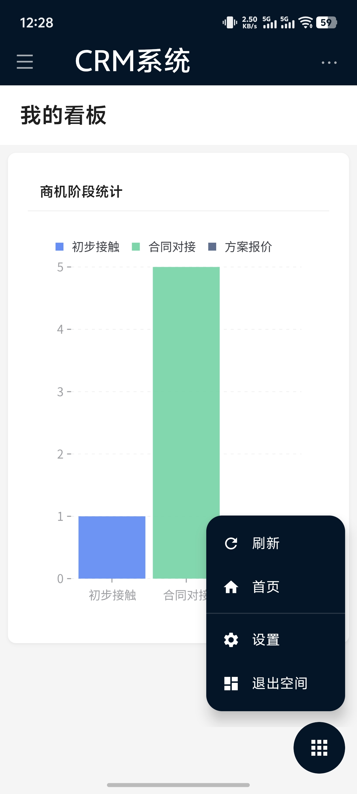

# Workspace（工作空间）

[](https://developer.android.com)
[](https://kotlinlang.org/)
[](https://developer.android.com/jetpack/compose)
[](https://www.nocobase.com)
[](https://www.apache.org/licenses/LICENSE-2.0)

## 项目介绍

Workspace（工作空间）是一套面向 NocoBase 的第三方 Android 客户端，应用支持连接和管理多个 NocoBase 实例。它使用原生 Android 组件提供实例管理、登录认证、凭据存储、文件处理、下载和悬浮球等能力，同时使用 Android WebView 加载用户配置的 NocoBase 实例页面，尽量复用 NocoBase 原有的页面和业务能力，不重复实现 NocoBase 的业务界面。

项目目标是提供一个轻量、通用的 NocoBase 移动端客户端。

## 主要功能

- 多实例管理：添加、编辑、删除和设置默认 NocoBase 实例。
- 多账号支持：同一实例可以保存不同账号的独立配置。
- 自动登录：在本地凭据和会话有效时恢复登录状态。
- 原生认证：使用 NocoBase 标准用户名/密码认证接口。
- WebView 容器：加载用户配置的 NocoBase 实例首页，并处理返回、刷新、外部链接和会话恢复。
- 文件上传：支持拍照、相册选择、系统文件选择器和多文件选择。
- 文件下载：使用 Android DownloadManager 处理附件下载。
- 悬浮控制球：支持拖拽、左右吸附、位置记忆、透明度调节和快捷操作。
- Material 3 界面：支持浅色模式、深色模式和中英文界面。

## 应用截图

| 01-无空间界面 | 02-工作空间列表 | 03-添加工作空间 | 04-编辑工作空间 |
| :---: | :---: | :---: | :---: |
|  |  |  |  |

| 05-重新登录界面 | 06-设置界面 | 07-进入工作空间 | 08-悬浮按钮和菜单 |
| :---: | :---: | :---: | :---: |
|  |  |  |  |

## 技术架构

| 模块 | 实现方式 |
| --- | --- |
| 开发语言 | Kotlin |
| 界面框架 | Jetpack Compose + Material 3 |
| 实例与账号配置 | Room / DataStore |
| 密码和 Token 保护 | Android Keystore + AES-GCM |
| 网络请求 | OkHttp |
| NocoBase 页面 | Android WebView |
| 文件选择 | Android Activity Result API |
| 文件下载 | Android DownloadManager |
| 最低系统版本 | Android 8.0（API 26） |
| 目标系统版本 | Android API 37 |

## 登录与 API 访问方式

Workspace 不通过自建中转服务器访问 NocoBase，网络请求由客户端直接发送到用户配置的 NocoBase 实例。

### 登录认证

用户输入实例地址、用户名和密码后，客户端通过 OkHttp 请求 NocoBase 标准认证接口：

```http
POST /api/auth:signIn
Content-Type: application/json
X-Authenticator: basic
```

请求体使用标准账号密码字段：

```json
{
  "account": "用户名",
  "password": "密码"
}
```

登录成功后，客户端读取 NocoBase 返回的 Token，并与当前实例、账号建立对应关系。

### 会话校验

客户端通过以下接口检查 Token 是否仍然有效：

```http
GET /api/auth:check
```

应用会区分有效会话、明确的 401/403 未授权和网络异常，避免把网络故障误判为密码错误。

### WebView 会话

认证成功后，客户端会在当前实例的 WebView 页面中写入对应会话信息，并限制 Token 只能注入到匹配的 HTTP(S) 来源。外部网站和其他实例不会获得当前实例的 Token。

WebView 加载的是用户填写的 NocoBase 实例地址，具体页面、菜单、数据权限和业务功能由对应 NocoBase 实例的版本、插件和用户权限决定。

## 数据存储与安全说明

- 用户名、密码、Token 和 WebView 相关数据保存在本地设备。
- 凭据不会上传到 Workspace 开发者或其他第三方服务器。
- 登录时，必要的账号密码信息会直接发送到用户主动配置的 NocoBase 实例，这是完成 NocoBase 登录所必需的。
- 密码和 Token 使用 Android Keystore 保护的密钥进行 AES-GCM 加密存储。
- 应用不会把账号密码写入普通日志。
- 使用 HTTP 实例时，账号、密码和 Token 可能在传输过程中被窃听，生产环境建议使用 HTTPS。
- 实例本身的账号权限、HTTPS、反向代理和 NocoBase 安全配置由使用者负责。

## 兼容性

- NocoBase：2.0 及以上版本
- Android：8.0（API 26）及以上
- 认证方式：NocoBase 标准 Basic Authenticator 接口
- SSO、MFA、验证码及第三方认证插件尚未作完整验证

## 安装与使用

1. 从 [Releases](../../releases) 下载 APK。
2. 在 Android 设备上安装。
3. 添加 NocoBase 实例地址。
4. 输入账号和密码完成登录。

使用前，请确保 Android 设备可以通过网络访问目标 NocoBase 实例。

## 本地构建

### 环境要求

- Windows 10/11 或其他支持 Android Studio 的开发环境
- Android Studio
- Java 25
- Gradle Wrapper 9.6.0
- Android SDK API 37

仓库已包含 `gradle/wrapper/gradle-wrapper.jar`，通常不需要手动生成 Gradle Wrapper。

### 构建命令

```bash
git clone https://github.com/charce526/workspace-android.git
cd workspace-android
./gradlew :app:assembleRelease
```

Windows PowerShell 或命令提示符：

```powershell
.\\gradlew.bat :app:assembleRelease
```

Release APK 输出位置：

```
app/build/outputs/apk/release/Workspace_v1.0.0_release.apk
```

Release 编译前，需要将 `keystore.properties.example` 复制为项目根目录下的 `keystore.properties`，并填入现有签名配置。真实签名配置和 `.jks` 文件不得提交到 Git，也不要重新生成签名身份。

## 项目开发者

- 开发者：偕作BIM
- 组织：厦门偕作建筑咨询有限公司
- 官网：https://www.xzbim.cn
- 项目仓库：https://github.com/charce526/workspace-android

## 致谢与相关项目

本项目基于 NocoBase 的开放能力开发，感谢 NocoBase 社区及贡献者提供的开源项目和文档资源。

- NocoBase 官网：https://www.nocobase.com
- NocoBase GitHub 仓库：https://github.com/nocobase/nocobase
- NocoBase 官方文档：https://docs.nocobase.com
- NocoBase 社区论坛：https://forum.nocobase.com

Workspace 是独立第三方客户端，不代表 NocoBase 官方立场。NocoBase 名称及相关商标归其各自权利人所有。

## 开源许可

本项目采用 [Apache License 2.0](https://www.apache.org/licenses/LICENSE-2.0) 开源。
